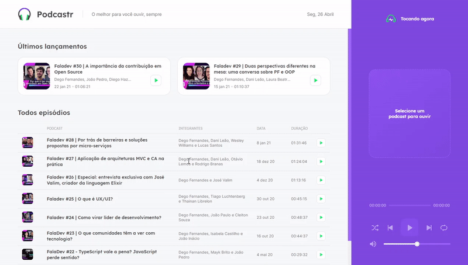

<h1 align="center">Podcastr</h1>

<p align="center">Projeto criado na NLW#05 da Rocketseat</p>

<p align="center">
  
</p>

<h1 align="left">🎯 O projeto </h1>

<p> O Podcastr trata-se de uma plataforma para escutar o seu podcast preferido de programação! <br/>
Essa aplicação foi desenvolvida durante a Next Level Week #05 da Rocketseat. </p>

<h1 align="left">🛠️ Tecnologias </h1>

- [React](https://pt-br.reactjs.org/)
- [TypeScript](https://www.typescriptlang.org/)
- [Next.js](https://nextjs.org/)

<h1 align="left">⚙️ Instalação </h1>

### 🔙 Pré-requisitos

Antes de começar, você vai precisar ter instalado em sua máquina as seguintes ferramentas:
[Git](https://git-scm.com), [Node.js](https://nodejs.org/en/) e [Yarn](https://yarnpkg.com/). </br>
Além disso é bom ter um editor para trabalhar com o código como o [VSCode](https://code.visualstudio.com/)

### 🔽 Clonando o repositório
```bash
$ git clone https://github.com/victorsantss/NLW-5-Next.js.git
```

### 🖥️ Iniciando a aplicação

```bash
# Acesse a pasta do projeto no terminal/cmd
$ cd NLW-5-Next.js

# Instale as dependências
$ yarn install

# Execute a aplicação em modo de desenvolvimento
$ yarn dev

# Em um segundo terminal, execute o servidor
$ yarn server

# O servidor inciará na porta:3000 - acesse <http://localhost:3000>
```

### 🔗 Link do projeto online

[Podcastr](https://podcastr-five.vercel.app/)

<hr />

<p align="center">This project was made with 💙 by Victor Santos</p>
